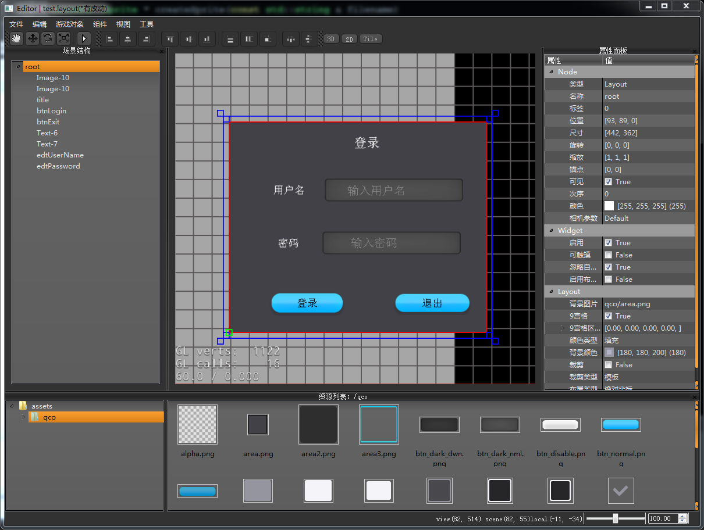

# qco-editor
用于cocos2d-x的开源编辑器，使用Qt和C++开发，支持Windows和Mac等操作系统。

名称 | 描述
---- | ----
作者 | 游蓝海([youlanhai](https://github.com/youlanhai))
项目主页 | https://github.com/youlanhai/qco-editor
开始时间 | 2015年10月

[下载编辑器beta版v0.1-windows可执行程序](https://pan.baidu.com/s/1eSBSFDK)

<br>



## 由来
2015年的时候，也没有好用的cocos2d-x编辑器，就琢磨着自己开发一款开源的编辑器，于是就搭了个框架[cc-qt-framework](https://github.com/youlanhai/cc-qt-framework)。后来公司开2d项目，就继续完善了一下，用到了项目中。再后来项目解散，编辑器就没有用武之地了，留着也是浪费。虽然架构不是很好，但总能帮助到一些想做编辑器的朋友。

## 寄语
将编辑器开源，一方面希望能帮助到一些朋友，另一方面也希望能借助开源的力量，将该项目继续发展下去。

由于工作繁忙，我也没有太多时间添加一些新功能。我会抽空修复一些bug，并添加一些文档。如果对该项目感兴趣的朋友，可以一起开发。

Bug反馈请提Issue，接受Pull Request。

# 如何编译
## 准备
* cocos2d-x v3.x
* Qt5.4+
* CMake2.8+
* Visual Studio 2013+(for Windows) or XCode(for MacOS)
注意：Qt的版本需要和Visual Studio或XCode的版本对应。

## 编译cocos2d-x
将cocos2d-x源代码放在本项目根目录下，文件夹命名为`cocos2d-x`。当然你也可以修改`framework.pri`文件中的`CC_ROOT_PATH`变量，指定cocos2d-x源代码的路径。

下面提供两种编译cocos2d-x的方法，各有优缺点。使用cmake的话，可以导入到Qt creator中，代码跳转比较方便。但是cocos2d-x不能保证cmake总是会编译成功(尤其是windows平台，编译错太多)。

### 使用vs/xcode编译cocos2d-x
1. 用vs/xcode打开cocos2d-x的工程文件，然后编译生成lib文件。
2. 将生成的cocos2d-x lib文件，拷贝到`cocos2d-x-debug/lib`目录下
3. 将生成的dll/so文件，拷贝到`bin/debug/platform`目录下

### 使用cmake编译cocos2d-x
1. 用Qt creator导入`cocos2d-x/CMakeLists.txt`
2. 目标目录设为：`cocos2d-x-debug`
3. CMake参数为：`-DCMAKE_BUILD_TYPE=Debug -DBUILD_CPP_TESTS=OFF -DBUILD_JS_LIBS=OFF -DBUILD_LUA_LIBS=ON -DBUILD_LUA_TESTS=OFF`
4. 然后点击`执行CMake`

注意：release模式下，上面参数中的`debug`换成`release`

## 编译编辑器
用Qt creator打开qco-editor.pro，进行编译。如果编译的过程中，遇到cocos2d-x相关的编译错误，可以参考[这里的文档](doc/fix-cocos2d-x-compile-error.md)，进行手动修复。

mac系统工程设置，需要添加后处理阶段，用于将so文件中的绝对路径，替换成相对路径，并把so打包到app包中：
```
command: python
arguments: tools/resolvelib.py -m app -app-name qco-editor-debug -app-path bin/debug/mac
working dir: path/to/project
```

## 发布程序
用于将Qt库文件，拷贝到应用程序包里。

1. mac 
`qt_path/5.x/clang_64/bin/macdeployqt destdir/qco-ditor-release.app`
2. windows 
`qt_path/5.x/msvcx/bin/windeployqt.exe destdir/qco-ditor-release.exe`

# 特性
+ 开源。不支持的功能，可以自己扩展。
+ 跨平台。支持windows，Mac等平台。理论上Qt和cocos2d-x能支持的平台都可以运行。
+ 支持UI编辑。
+ 支持2D场景编辑。

# TODO
+ 整理序列化功能。能够时时刷新变化的属性；存档时剔除与默认值相同的属性。
+ 优化Layout文件结构，去除层级结构。
+ 整理Layout加载器，支持版本升级。
+ 支持插件热重载。
+ 支持prefab功能。

# 贡献者
